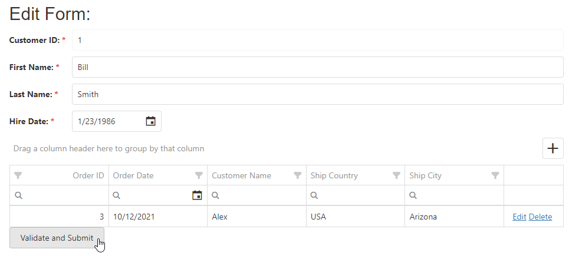

<!-- default badges list -->

[](https://supportcenter.devexpress.com/ticket/details/T590924)
[](https://docs.devexpress.com/GeneralInformation/403183)
[](#does-this-example-address-your-development-requirementsobjectives)
<!-- default badges end -->
# Form for DevExtreme - How to submit a DataGrid model with form values

The DevExtreme [Form](https://js.devexpress.com/Documentation/ApiReference/UI_Components/dxForm/) can collect information from all inputs inside an HTML form and post it to the server. The [DataGrid](https://js.devexpress.com/Documentation/ApiReference/UI_Components/dxDataGrid/) does not initially render hidden inputs, so when the grid is placed into a form item template, its data is not passed to the server on submit.

This example shows how to create hidden inputs for each DataGrid row at runtime (named `Orders[index].PropertyName`) and place them onto the HTML form, so the posted payload includes both the Form values and the DataGrid rows.



In the submit button's click handler, validate the form's validation group, load the grid's data items, and serialize each item property into a hidden input:

```js
function createInputElement(itemName, itemValue, itemIndex, container) {
  $('<input/>')
    .appendTo(container)
    .attr({ type: 'hidden', name: `Orders[${itemIndex}].${itemName}` })
    .val(itemValue);
}
```

The ASP.NET Core project performs a real round trip: the posted payload is bound to a `Customer` model (including the `Orders` collection) in the controller. The client-side projects (jQuery, Angular, React, Vue) display the serialized payload that would be posted.

## Files to Review

- **jQuery**
    - [index.js](jQuery/src/index.js)
- **Angular**
    - [app.component.html](Angular/src/app/app.component.html)
    - [app.component.ts](Angular/src/app/app.component.ts)
- **Vue**
    - [HomeContent.vue](Vue/src/components/HomeContent.vue)
- **React**
    - [App.tsx](React/src/App.tsx)
- **ASP.NET Core**
    - [Index.cshtml](ASP.NET%20Core/Views/Home/Index.cshtml)
    - [HomeController.cs](ASP.NET%20Core/Controllers/HomeController.cs)

## Documentation

- [Getting Started with Form](https://js.devexpress.com/Documentation/Guide/UI_Components/Form/Getting_Started_with_Form/)
- [Form - API Reference](https://js.devexpress.com/Documentation/ApiReference/UI_Components/dxForm/)
- [DataGrid - API Reference](https://js.devexpress.com/Documentation/ApiReference/UI_Components/dxDataGrid/)
<!-- feedback -->
## Does This Example Address Your Development Requirements/Objectives?

[](https://www.devexpress.com/support/examples/survey.xml?utm_source=github&utm_campaign=devextreme-form-submit-datagrid-model-with-form-values&~~~was_helpful=yes) [](https://www.devexpress.com/support/examples/survey.xml?utm_source=github&utm_campaign=devextreme-form-submit-datagrid-model-with-form-values&~~~was_helpful=no)

(you will be redirected to DevExpress.com to submit your response)
<!-- feedback end -->
