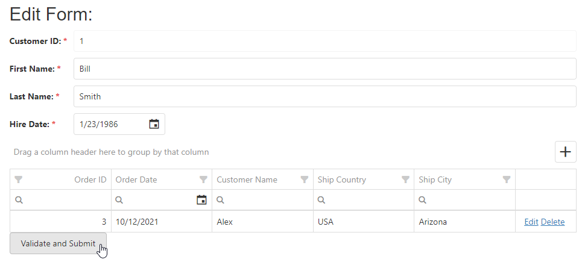

<!-- default badges list -->

[](https://supportcenter.devexpress.com/ticket/details/T590924)
[](https://docs.devexpress.com/GeneralInformation/403183)
<!-- default badges end -->

# DevExtreme ASP.NET MVC Form - How to submit a DataGrid model with form values

The DevExtreme ASP.NET MVC [Form](https://docs.devexpress.com/AspNetCore/DevExtreme.AspNet.Mvc.Builders.FormBuilder-1) can collect information from all hidden inputs and then post it to the Controller. The [DataGrid](https://docs.devexpress.com/AspNetCore/DevExtreme.AspNet.Mvc.Builders.DataGridBuilder-1) does not initially have a hidden input, and the grid is placed into the form items template. If you assign model values to the grid's [dataSource](https://docs.devexpress.com/AspNetCore/DevExtreme.AspNet.Mvc.Builders.DataGridBuilder-1.DataSource(DevExtreme.AspNet.Mvc.JS)) option, the model values are not passed to the server. 

This example shows how to create hidden inputs for each DataGrid row at runtime and place the hidden inputs onto the form. 

[[Run Online]](https://codecentral.devexpress.com/t590924/)



Specify the "name" attribute option of the hidden input element. Then, get grid data items from the **clickHandler** event. Save the data items to the input element in the **CreateInputElement** function. 

```cshtml
<script>
    function CreateInputElement(itemName, itemValue, itemIndex, container) {
        var $input = $("<input/>");

        $input.appendTo(container).attr({ type: "hidden", name: "Orders[" + itemIndex + "]." + itemName }).val(itemValue);
    }
    function clickHandler(e) {
        if (e.validationGroup.validate().isValid) {
            $("#grid").dxDataGrid("instance").getDataSource().load().done(function (items) {
                for (var i = 0; i < items.length; i++) {
                    var item = items[i];
                    for (var property in item) {
                        if (item.hasOwnProperty(property)) {
                            CreateInputElement(property, item[property], i, $("#editEmployee")[0]);
                        }
                    }
                }
                $("#editEmployee").submit();
            })
        }
    }
</script>
```

## Files to Look At

- [HomeController.cs](./MVC/dxSampleT590924/Controllers/HomeController.cs)
- [Order.cs](./MVC/dxSampleT590924/Models/Order.cs) 
- [Index.cshtml](./MVC/dxSampleT590924/Views/Home/Index.cshtml)
- [Success.cshtml](./MVC/dxSampleT590924/Views/Home/Success.cshtml)

## Documentation

- [Getting Started with Form](https://js.devexpress.com/Documentation/Guide/UI_Components/Form/Getting_Started_with_Form/)
- [Model Binding in ASP.NET Core](https://docs.microsoft.com/en-us/aspnet/core/mvc/models/model-binding?view=aspnetcore-6.0)


## More Examples

- [Form - How to customize form items](https://github.com/DevExpress-Examples/Form-Custom-items)
